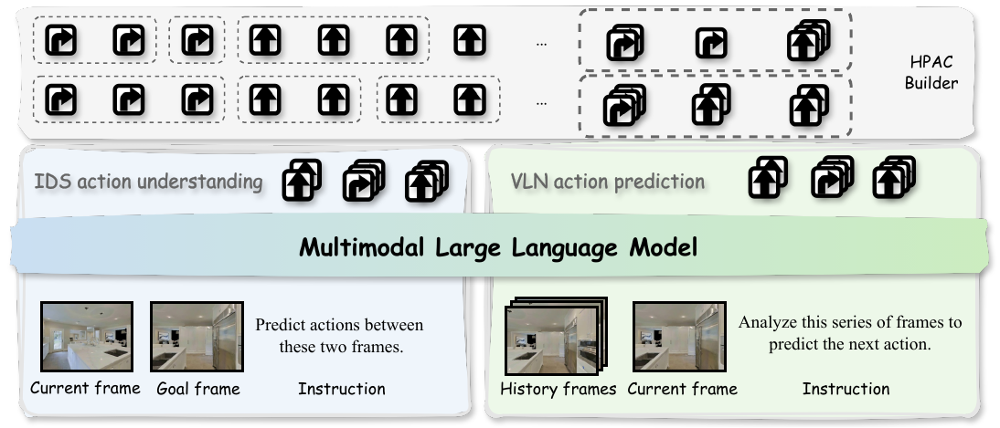
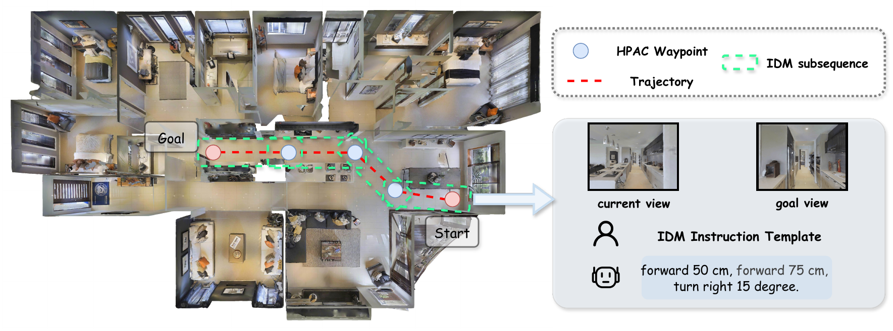

<div align="center">
  <h1 style="font-size: 32px; font-weight: bold;">NaVIDA: Vision-Language Navigation with Inverse Dynamics Augmentation</h1>

  <p style="font-size: 18px; color: #666;">
    <em>A lightweight VLN framework with inverse dynamics supervision for action-grounded visual dynamics</em>
  </p>
</div>

<p align="center">
    <a href="https://arxiv.org/abs/2601.18188">
      
    </a>
    <a href="https://huggingface.co/waynechu/NaVIDA">
      
    </a>
    <a href="https://github.com/waynechu1021/NAVIDA/stargazers">
      
    </a>

</p>


<br>

## 📰 News

| Date | News |
|:---:|:---|
| **2026-03-17** | 🔥 **Code Release**: [Checkpoints](https://huggingface.co/waynechu/NaVIDA/) and full code are now available! |
| **2026-01-26** | 📄 **Paper Release**: Paper is available on [arXiv](https://arxiv.org/abs/2601.18188)! |

<br>

## 📖 Abstract

NaVIDA is a lightweight Vision-Language Navigation (VLN) framework that incorporates **inverse dynamics supervision** as an explicit objective to embed action-grounded visual dynamics into policy learning. We employ **hierarchical probabilistic action chunking** to organize trajectories into multi-step chunks, enabling more effective navigation in continuous environments.

### Key Features

- 🎯 **Inverse Dynamics Supervision**: Explicitly learns action-grounded visual dynamics
- 🔄 **Hierarchical Action Chunking**: Organizes trajectories into multi-step chunks for better long-horizon planning
- 🚀 **Lightweight Design**: Efficient framework suitable for real-world deployment
- 🏆 **State-of-the-art Performance**: Achieves competitive results on VLN-CE benchmarks

<br>


<p align="center">
  
</p>

> **Figure 1**: Overview of NaVIDA framework. The model leverages inverse dynamics supervision to learn action-aware visual representations.

<br>

## 🛠 Getting Started

### Prerequisites

- Python 3.10
- CUDA 11.8+
- [Habitat-Sim](https://github.com/facebookresearch/habitat-sim) v0.2.4
- [Habitat-Lab](https://github.com/facebookresearch/habitat-lab) v0.2.4

### Setup the Environment

**1. Create Conda Environment**
```bash
conda create -n navida python=3.10
conda activate navida
```

**2. Install habitat-sim v0.2.4**
```bash
git clone --branch v0.2.4 https://github.com/facebookresearch/habitat-sim.git
cd habitat-sim
pip install -r requirements.txt
python setup.py install --headless
```

**3. Install habitat-lab v0.2.4**
```bash
git clone --branch v0.2.4 https://github.com/facebookresearch/habitat-lab.git
cd habitat-lab
pip install -e habitat-lab          # install habitat_lab
pip install -e habitat-baselines    # install habitat_baselines
pip install dtw fastdtw gym
```

**4. Install NaVIDA Dependencies**
```bash
pip install peft trl==0.16.0 transformers==4.50.3 tensorboardx qwen_vl_utils deepspeed distilabel wandb==0.18.3
pip install numpy==1.24.0 numba==0.60.0 tqdm opencv-python 
pip install vllm==0.9.1 torch torchvision protobuf==3.20
pip install flash-attn --no-build-isolation --no-cache-dir
```

<br>

### 📁 Data Preparation

#### Step 1: Scene Datasets

| Benchmark | Scene Dataset | Link |
|:---:|:---:|:---:|
| R2R, RxR, EnvDrop | MP3D | [Official Page](https://niessner.github.io/Matterport/) |
| ScaleVLN | HM3D | [Official GitHub](https://github.com/matterport/habitat-matterport-3dresearch) |

Place the datasets as follows:
```
data/
├── scene_datasets/
│   ├── mp3d/          # MP3D scenes for R2R/RxR/EnvDrop
│   └── hm3d/          # HM3D scenes for ScaleVLN (train split)
```

#### Step 2: Download VLN Episodes

| Dataset | Link |
|:---:|:---:|
| R2R VLN-CE Episodes | [Google Drive](https://drive.google.com/file/d/1fo8F4NKgZDH-bPSdVU3cONAkt5EW-tyr/view) |
| RxR VLN-CE Episodes | [Google Drive](https://drive.google.com/file/d/145xzLjxBaNTbVgBfQ8e9EsBAV8W-SM0t/view) |
| ScaleVLN Subset | [HuggingFace](https://huggingface.co/datasets/cywan/StreamVLN-Trajectory-Data/blob/main/ScaleVLN/scalevln_subset_150k.json.gz) |

#### Step 3: Data Processing (Training Only)

<p align="center">
  
</p>

> **Figure 2**: Data processing and training pipeline of NaVIDA.

```bash
# Convert data to unified format
./scripts/preprocess.sh

# Extract RGB frames
./scripts/extract_frame.sh

# Prepare training data
./scripts/prepare_training_data.sh
```

> **Note**: You can also prepare your DAgger data in the same format.

<br>

## 🔥 Training

```bash
./scripts/train.sh
```

<br>

## 🧭 Evaluation

### Option 1: Eval with HuggingFace Transformers

```bash
./scripts/eval.sh
```

### Option 2: Eval with vLLM (Faster Inference)

**Step 1: Launch vLLM Server**
```bash
./scripts/start_vllm_server.sh
```

**Step 2: Run Evaluation**
```bash
./scripts/eval_vllm.sh
```

<br>

## 🏆 Checkpoints

| Model  | Link |
|:---:|:---:|
| NaVIDA-3B | [HuggingFace](https://huggingface.co/Arvil/Qwen2.5-VL-3B_sft_r2r_envdrop_multiturn) |

<br>

## 📈 Results

NaVIDA achieves state-of-the-art performance on both R2R and RxR benchmarks with only 3B parameters, using only single RGB camera input.

<details>
<summary>R2R Val-Unseen</summary>


| Method | #Params | SR | SPL | NE | OS |
|:---:|:---:|:---:|:---:|:---:|:---:|
| NaVILA | 8B | 54.0 | 49.0 | 5.22 | 62.5 |
| StreamVLN | 7B | 56.9 | 51.9 | 4.98 | 64.2 |
| MonoDream | 2B | 55.8 | 49.1 | 5.45 | 61.5 |
| **NaVIDA (Ours)** | **3B** | **61.4** | **54.7** | **4.32** | **69.5** |
</details>
<br>
<details>
<summary>RxR Val-Unseen</summary>

| Method | #Params | SR | SPL | nDTW | NE |
|:---:|:---:|:---:|:---:|:---:|:---:|
| NaVILA | 8B | 49.3 | 44.0 | 58.8 | 6.77 |
| StreamVLN | 7B | 52.9 | 46.0 | 61.9 | 6.22 |
| NavFoM | 7B | 57.4 | 49.4 | 60.2 | 5.51 |
| **NaVIDA (Ours)** | **3B** | **57.4** | **49.6** | **67.0** | **5.23** |

</details>

<br>

## 🔗 Citation

If you find our work helpful, please consider starring this repo :star: and cite:

```bibtex
@article{zhu2026navida,
  title={NaVIDA: Vision-Language Navigation with Inverse Dynamics Augmentation},
  author={Zhu, Weiye and Zhang, Zekai and Wang, Xiangchen and Pan, Hewei and Wang, Teng and Geng, Tiantian and Xu, Rongtao and Zheng, Feng},
  journal={arXiv preprint arXiv:2601.18188},
  year={2026}
}
```

<br>

## 👏 Acknowledgements

We would like to thank the authors of the following projects for their great works:

- [NaVid](https://github.com/jzhzhang/NaVid-VLN-CE) - Video-based VLN framework
- [StreamVLN](https://github.com/InternRobotics/StreamVLN) - Streaming VLN approach
- [Habitat](https://github.com/facebookresearch/habitat-sim) - 3D simulation platform
